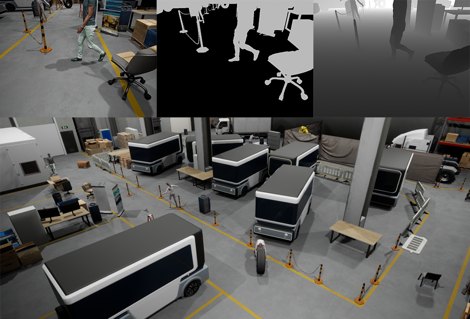

# Factory Data Generator
This repository contains the source code needed to generate ground truth data within a 3D simulated factory environment 
for the purpose of training and testing convolutional neural network-based obstacle detectors.
It accompanies the Master Thesis of Anton Backhaus with the title "Model fusion for robust monocular obstacle detection" 
presented at the Laboratory for Machine Tools and Production Engineering (WZL) at RWTH Aachen University.

The factory environment is not included in this repo and must be obtained seperately due to storage limitations of github.

With [UnrealCV](https://unrealcv.org/) and a factory environment created in [Unreal Engine 4](https://www.unrealengine.com/en-US/) RGB, binary segmentation and depth ground truth data can be generated.



## Requirements
* Unreal Engine 4.25 for Windows 10 (untested on Linux and not recommended; see [here](https://docs.unrealengine.com/en-US/Basics/InstallingUnrealEngine/index.html) for installation details)
* UnrealCV for Unreal Engine 4.25; see [here](https://github.com/unrealcv/unrealcv/tree/4.25)
* Python 3.7 (other versions should also work)
* Others ➡ requirements.txt

## Install (Windows)
After downloading and extracting the package cd into your root directory and run the following line from command prompt:
```bash
python setup.py install
```

## Scripts
* traj_generator.py is used to generate a camera trajectory around the factory. The trajectory is based on a semi-randomized
bezier curve. This ensures a unique camera perspective for each training set. For a fixed trajectory you just have to change
a few marked lines of code at the bottom. 
* demo.py can be used after creating a trajectory. This just shows the data but does not save it.
* data_generator.py will save all the images of the trajectory to a directory specified in config.py
Before executing demo.py or data_generator.py make sure that UE4 is actually running. If not it can cause UE4 to crash.
* metadata_generator.py generates a .json file containing a list of all frames at which the vehicle should stop depending
on the ∩-volume stopping criterion described in the thesis.
* visualize.py shows the generated RGB images and marks all pixels belonging to obstacles within the ∩-volume

## Issues
* If you have animations running in your simulation, i.e. dynamic objects, be sure to make them run slowly.
UnrealCV and UE4 run asynchronously causing RGB, segmentation and depth to be mismatched where there is movement in the scene
(see legs of person in the above image).
* I had an issue with UnrealCV preventing me from gathering data from the main camera which is why I had to use the fusion camera
actor that comes with UnealCV. This increases render times. Also, I coded the main camera actor to follow the fusion camera actor
since LODs load according to the distance to the main camera actor.
* The random trajectory generator is a bit janky and will sometimes cause the camera to cut corners or drift off to the side
of the path which is why I recommend using a fixed trajectory for testing.